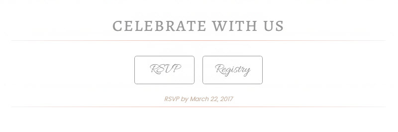
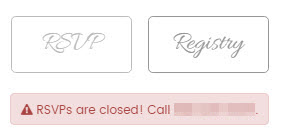
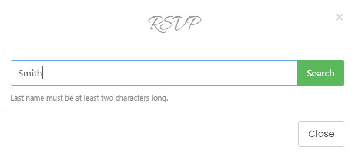
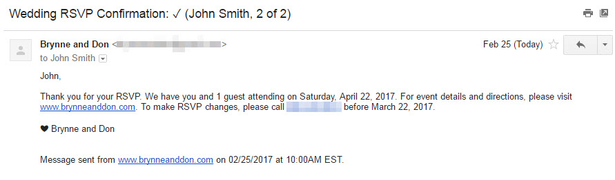
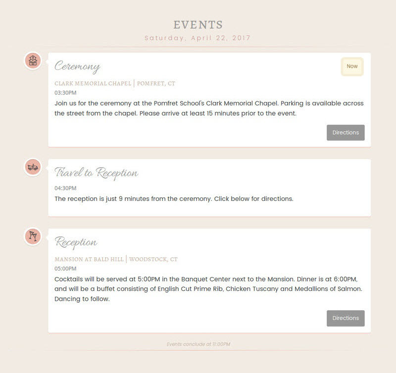
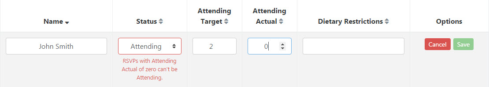
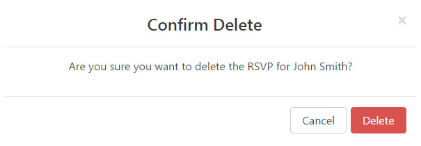

My sister's getting married. During a discussion about how to handle RSVPs for the big day, I floated the option of doing it online. This was a welcome idea; however, it meant she needed a website. The question, then, was to buy or build.

While exploring available options, my suspicions were confirmed: wedding websites are a cottage industry. There's a hodgepodge of do-it-yourself platforms out there promising a "customized look and feel", but the enter fiancé name _here_, and upload photo of you and partner _there_, routine almost invariably results in a ready-made feel (to say nothing of typically poor user experience on smaller devices). Additionally, one-size-fits-all approaches to online RSVPs tend to entail configuration-heavy setups, busy admin interfaces and less-than-seamless form integration on the guest-facing page.

Ultimately, I opted for build. Below is an overview of what turned out to be a really fun project. I've included links to a few resources that I found particularly helpful along the way.

[Visit Website](https://brynne-and-don.herokuapp.com/)

**Update:** Now that the wedding has passed, the site's on a free dyno, which may take a few seconds to spin up. (Fri May 5 2017)

---

## Technology

**tl;dr:** I used the [NERP stack](https://medium.com/@jkchuynh829/the-nerp-stack-29402b6a4355) with a webpack build, including hot reloading in development, as well as Nodemailer and Bootsrap 4.

### Back End

Node with Express is my go-to server setup these days. I've used a couple different build tool combinations in other Node-based projects (Grunt, gulp and/or webpack), but this was the first time I let webpack handle everything—JS(X), (S)CSS, HTML, [icons](https://paradite.com/2016/10/25/font-awesome-angular-2-webpack/), [fonts](https://shellmonger.com/2016/01/22/working-with-fonts-with-webpack/) and [images](https://survivejs.com/webpack/loading-assets/loading-/images/). It can capably and quickly do it all, and with [a little extra configuration](https://medium.com/@LopezTech/a-web-application-journey-part-3-webpack-dev-server-and-related-improvements-abd5060bd3fc) you get hot reloading for React components in development, which is _awesome_. I spun up a Postgres database on Heroku to store RSVPs, which is also where the server runs, and used [pg-promise](http://mherman.org/blog/2016/03/13/designing-a-restful-api-with-node-and-postgres/#.WLHfR1UrLIV) to execute CRUD actions. I also used [Nodemailer](http://javascript.tutorialhorizon.com/2015/07/02/send-email-node-js-express/) to send guest confirmation and admin notification emails via Gmail, which took some extra configuration as it requires [XOAuth2](http://masashi-k.blogspot.com/2013/06/sending-mail-with-gmail-using-xoauth2.html). Lastly, the admin RSVP management page and its associated API routes are protected using Passport local authentication.

### Front End

In conjunction with React, I used an alpha release of [Bootstrap 4](https://www.artembutusov.com/webpack-customizable-bootstrap-4-x-scss/) for the framework. I've been using version 3 for a few years now, and the short lifecycle of this project gave me an opportunity to test drive some of the [changes, additions and removals](https://v4-alpha.getbootstrap.com/migration/) coming in version 4. I also made use of Animate, Moment, Underscore, D3 and Crossfilter in different places.

---

## Guest Splash Page

**tl;dr:** The guest-facing splash page is comprised of 6 sections containing React components; how some components render depends on the current date.

### Intro

This component renders a responsive full screen background image with animated [overlay text](https://css-tricks.com/design-considerations-text-/images/), a bouncing chevron icon that triggers some [jQuery-free scroll animation](https://gist.github.com/joshcanhelp/a3a669df80898d4097a1e2c01dea52c1) and parallax scrolling on larger devices.


### Actions / Thank You

One of the biggest benefits of building user interfaces with React is that it makes conditional rendering really easy. This section renders components differently based on the current date's relationship to the wedding and RSVP dates.

Before the wedding date, this section renders a component with two action buttons: a hook for RSVPs and a link to the Registry.



As the RSVP date approaches/passes, the RSVP action button renders accordingly.

```grid|3|Open • Closing Soon • Closed



```

RSVPs are submitted through a series of modal screens launched from the RSVP action button.

_Search_



_Form_


_Result_


If the guest provides an email address in the RSVP form, then they receive a confirmation email.



The admin receives a notification email each time an RSVP is submitted.


After the wedding date, this section renders a component with a thank you note so the page isn't anachronistic.


### Bios

This component renders bride and groom bios using Bootstrap 4's new [Card component](https://v4-alpha.getbootstrap.com/components/card/).


### Events

This component is based on a [responsive vertical timeline template](https://codyhouse.co/gem/vertical-timeline/). I added rotating [icons](http://www.flaticon.com/packs/wedding-and-love), a happening now indicator and directions (in a modal) using the [Google Maps Embedded API](https://developers.google.com/maps/documentation/embed/guide) (with [geolocation](https://developers.google.com/maps/documentation/javascript/geolocation)).

_Timeline_



_Directions_


### Photos

This component renders a Bootstrap 4 [Carousel component](https://v4-alpha.getbootstrap.com/components/carousel/).


### Outro

Before the wedding date, this component renders a count down over a responsive full screen background image with parallax scrolling on larger devices. After the wedding date, the count down becomes a count up.

_Count Down_


_Count Up_


---

## Admin RSVP Management Page

**tl;dr:** The admin-facing RSVP management page has a header with add, search and filter icons, in addition to two tabs: one to review RSVPs at a high level and another to review, edit and delete individual RSVPs.

### Header

The header has icons for adding a new RSVP (in a modal), searching RSVPs by name (using [react-bootstrap-typeahead](https://github.com/ericgio/react-bootstrap-typeahead)) and filtering RSVPs by status.

_Add_


_Search_


_Filter_


### Summary Tab

The summary tab renders two donut charts: one summarizing RSVPs and another summarizing attendance.


### Details Tab

The details tab renders a sortable table with a sticky header and export to Excel functionality. Each RSVP row has an edit and delete icon.


RSVPs are edited inline with validations for each attribute.



RSVPs are deleted by way of modal confirmation.



---

## Performance

From Google's [PageSpeed Insights](https://testmysite.thinkwithgoogle.com/):


---

## Feedback

Have questions, comments or suggestions? Reach out to me on Twitter ([@colinrcummings](https://twitter.com/colinrcummings)).

— Colin
