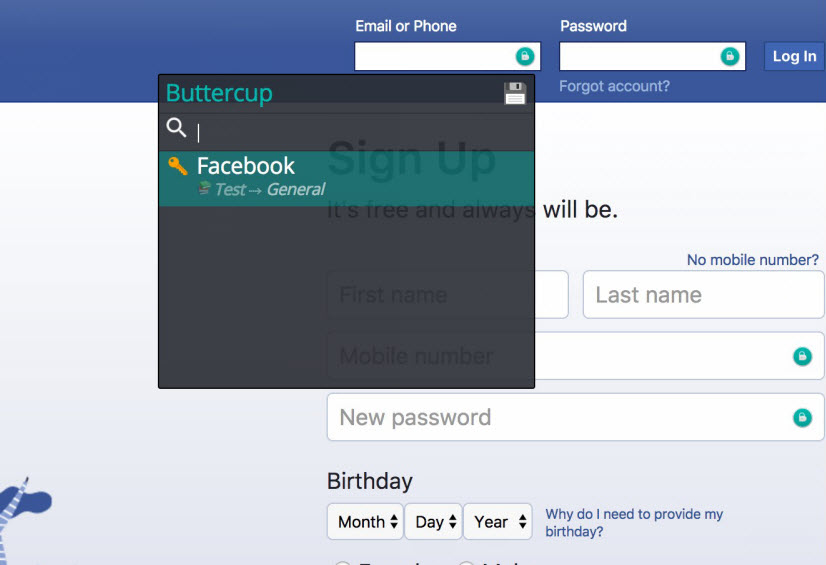

My New Year's resolution was to start using a [password manager](https://www.youtube.com/watch?v=xHSnHj-zKF4). There are a lot of password managers out there, but I ultimately decided on [Buttercup](https://buttercup.pw/).

---

## Buttercup

Buttercup is a free, secure, cross-platform credentials manager. Your credentials are stored in an encrypted archive that resides on a file hosting service of your choice, which you can access from a desktop, browser and/or mobile device.

_Desktop:_

_Browser:_

_Mobile:_

---

## Setup

Setting up Buttercup was easy. In just a few minutes, I downloaded Buttercup for desktop, create a `.bcup` archive on Dropbox, connected Buttercup to Dropbox and created a master password for the archive. The hard part was updating my existing accounts with secure passwords (i.e. changing `myP@ssw0rd_1` to something like `w7bsN5jcBdknz[<!VS:+mv.5t+Vrtt`) and adding them to Buttercup. The Buttercup desktop application has a built-in password generator, which was very helpful. When I was done, I downloaded Buttercup for mobile, connected it to Dropbox, entered my archive master password and there were all of my credentials.

---

## Usage

I've been using Buttercup for a few weeks now, and I really like it. Having a password manager significantly decreases the cognitive load of remembering different credentials for dozens of accounts. Logging into an account is now as easy as opening Buttercup, copying my account credentials and pasting them into the login form (it's even easier with the browser extension). Using Buttercup is also a real treat—it seamlessly keeps my credentials in synch and the UI/UX is really impeccable accross platforms. The thing I like most about using Buttercup, however, is that it's [open source](https://opensource.org/faq#osd). A couple things that I'm keeping an eye on:

_Desktop:_

- [Change archive's password](https://github.com/buttercup/buttercup-desktop/issues/78)

_Browser:_

- [Make auto-submit optional](https://github.com/buttercup/buttercup-browser-extension/issues/94)

_Mobile:_

- [Touch to unlock](https://github.com/buttercup/buttercup-mobile/issues/22)
- [Password generator](https://github.com/buttercup/buttercup-mobile/issues/23)

Check out the [roadmap](https://github.com/buttercup/roadmap) for more information.

---

## Feedback

Have questions, comments or suggestions? Reach out to me on Twitter ([@colinrcummings](https://twitter.com/colinrcummings)).

— Colin
