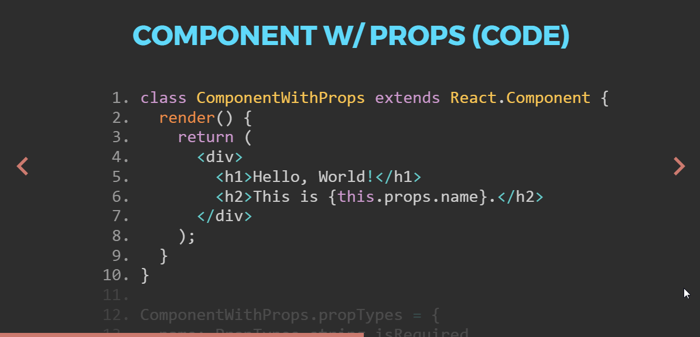

I've been using [React](https://facebook.github.io/react/) for a few years now. If you read my [previous post](/posts/a-wedding-website/), then you know that it's my go-to library for creating user interfaces (including [this blog](https://github.com/colinrcummings/blog)). I was recently asked to give a presentation on React at one of the software development Meetups I attend. I opted to introduce the library, walk through a couple of core concepts (with examples), do a few ad hoc demos and then leave the audience with some additional concepts, resources and tools. Below is an overview of [Spectacle](http://formidable.com/open-source/spectacle/), the library I used to create the presentation.

[View Presentation](http://colinrcummings.github.io/meetup-react)

---

## Spectacle

Spectacle bills itself as "A React.js based library for creating sleek presentations". It's _awesome_. Being able to use components to compose a presentation about React felt right from the start. Out of the box, the library provides [tags](https://github.com/FormidableLabs/spectacle#tag-api) for core slideshow objects you're probably already familiar with from another [presentation program](https://www.youtube.com/watch?v=uNjxe8ShM-8) that shall not be named. Two things really set Spectacle apart from [other web-based presentation tools](https://github.com/search?l=JavaScript&o=desc&q=presentation&s=stars&type=Repositories&utf8=%E2%9C%93):

### Code Slides

Embedding code in a presentation isn't new, but with the [spectacle-code-slide](https://github.com/thejameskyle/spectacle-code-slide) extension I was able to step through my example code with syntax highlighting and contextual notes.

### Embedded Examples

Because the entire Spectacle presentation is a React component, I was able to embed my example components into my slides and interact with them live.

---

## Feedback

Have questions, comments or suggestions? Reach out to me on Twitter ([@colinrcummings](https://twitter.com/colinrcummings)).

— Colin
