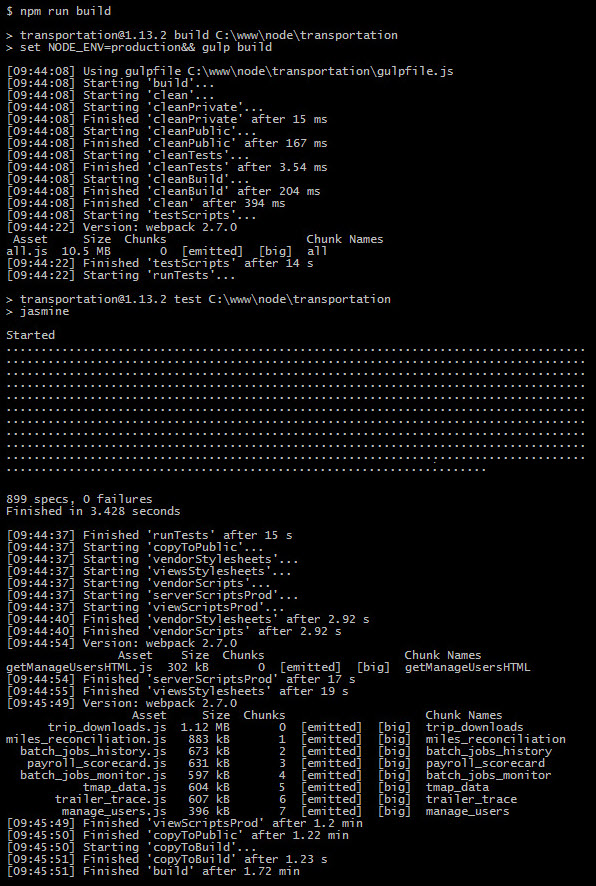
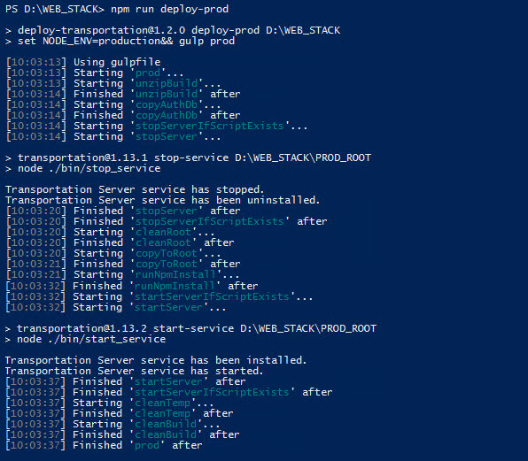

Over the years, I've used a few different combinations of frameworks, libraries and tools, some of which come with environment workflows out-of-the-box and others that do not. With the [rising popularity of Node.js](https://trends.google.com/trends/explore?date=all&q=%2Fm%2F0505cl,%2Fm%2F06y_qx,%2Fm%2F0bbxf89), the need to roll one's own environment workflows is also on the rise, as is the number of resources with which to do so. I recently give a presentation about this topic at one of the software development Meetups I attend; below is an overview of the presentation, the lion's share of which was a live demo.

[View Presentation](https://colinrobertbrooks.github.io/meetup-gulp)

---

## Background

I like writing code; I don't like performing repetitive tasks like manipulating files, migrating folders, running scripts, _et cetera_. Accordingly, I make optimizing develop, build and deploy workflows across development, test and production environments a priority in every project. Inevitably, this is a tradeoff between [magic and boilerplate](https://twitter.com/phillip_webb/status/705909774001377280?lang=en).

When I was getting started with development, I used [Ruby On Rails](http://rubyonrails.org/), which is preconfigured with pretty good, albeit magic-laden, develop and build workflows for development and production environments that are powered by its [Asset Pipeline](http://guides.rubyonrails.org/asset_pipeline.html). Additionally, [Heroku](https://www.heroku.com/) offers a nice [Rails deploy workflow](https://devcenter.heroku.com/articles/getting-started-with-rails4#deploy-your-application-to-heroku) for test and production environments. If you've worked with Rails like this before, then you know that it's great... until it isn't.

```grid|3|The good • The bad • The ugly


```

While I still use Rails in some existing projects (including [PeakBucket](https://www.peakbucket.com/)), I've come to prefer [Node.js](https://nodejs.org/) when starting new ones. Node leaves configuration almost entirely up to the developer, but with freedom comes responsibility—and often boilerplate. Some tools, like [Create React App](https://github.com/facebookincubator/create-react-app), provide preconfigured (_i.e._ boilerplate-free) develop and build workflows for development and production environments with the option to "eject" and customize the configuration at any time. For more complex applications, however, you often need more control; for me, this is where [gulp.js](https://gulpjs.com/) comes into play.

With over 3 million downloads a month, gulp needs little introduction. While it's not the only tool of its kind, nor is it as widely used as [webpack](https://webpack.github.io/) (with over 8 million downloads a month), its flexibility, strong ecosystem and interoperability with other tools (including webpack) make it my choice for managing environment workflows in more complex applications.

---

## Example

At work, I maintain a Node project that's an [Express](https://expressjs.com/) application comprised of multiple single-page [React](https://reactjs.org/) applications. Configured like this, Express handles database connections, view/web service routes and user authentication server-side, while React handles user interactions client-side. Here are the workflows I've configured for this application:

### Develop

Optimized for developer experience, the develop workflow is tuned to minimize wait time and manual tasks in order to maximize code quality and output in the development environment. On startup, it copies static files, transpiles SASS files and compiles JS(X) files into the public directory. It uses [nodemon](https://github.com/remy/nodemon) for a runtime, which automatically restarts the server when watched files change, and uses individual database connections per web service request to avoid acquiring additional connections with each restart (the application uses database pools in other environments). Because webpack bundles the view scripts, it also takes advantage of [Hot Module Replacement](https://webpack.github.io/docs/hot-module-replacement.html) (including [React Hot Loader](https://gaearon.github.io/react-hot-loader/)) in addition to [Webpack Bundle Analyzer](https://github.com/webpack-contrib/webpack-bundle-analyzer).


### Build

One of 12 items on [The Joel Test](https://www.joelonsoftware.com/2000/08/09/the-joel-test-12-steps-to-better-code/), making a build in one step, for use in either the test or production environment, is what this workflow is all about. Prior to making a build, it runs a unit test suite, which covers all aspects of the application (including database connections, web service calls, business logic and user authentication/interaction). In addition to copying/transpiling/compiling minified public assets, it also copies all of the other files required for running the application (models, views, controllers, routes, _et cetera_) into a build directory.



### Deploy

One additional piece of complexity with this application is that it's deployed to a Windows Server hosted on a VPN. My goal in creating this workflow was to replicate the ease of `$ git push heroku master`, which I've enjoyed with other applications. It's split into two commands: one run locally and another run on the server, which leaves the flexibility to deploy to multiple environments server-side.

Locally, the deploy workflow runs the build workflow, zips the build directory and coppies the zipped build directory to the server.


On the server, the build can be deployed to either the test or production environment:

In the test environment, the deploy workflow on the server unzips the zipped build directory, migrates build files and updates node modules. The test environment runtime is started manually as a process attached to the console (_i.e._ `$ npm start`).


In the production environment, the deploy workflow on the server unzips the zipped build directory, performs a database backup, stops the runtime daemon process, migrates build files, updates node modules and starts the runtime daemon process. The production environment runtime is a native Windows service courtesy of the [node-windows](https://github.com/coreybutler/node-windows/) module.



---

## Feedback

Have questions, comments or suggestions? Reach out to me on Twitter ([@colinrbrooks](https://twitter.com/colinrbrooks)).

— Colin
