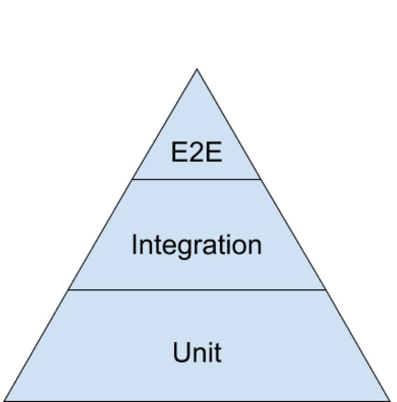

In 2018, I doubled down on my testing game. Going into the year, I was primarily writing [unit tests](https://en.wikipedia.org/wiki/Unit_testing), with [Jasmine](https://jasmine.github.io/) as my go-to test runner. In backend tests I was using [Sinon](https://sinonjs.org/) for spies, stubs and mocks; in frontend tests I was using Sinon in addition to [Enzyme](https://airbnb.io/enzyme/) for testing [React](https://reactjs.org/) components. I was also using an [ESLint](https://eslint.org/) editor plugin with a rigorous set of rules. While this was all--in theory--"good" (the 2018 Frontend Tooling Survey showed that 75% of respondents were [using a linter](https://ashleynolan.co.uk/blog/frontend-tooling-survey-2018-results#js-linters), but only 54% were [writing tests](https://ashleynolan.co.uk/blog/frontend-tooling-survey-2018-results#js-testing)), it ultimately ranked about halfway up both the canonical testing pyramid and [Kent C. Dodds'](https://twitter.com/kentcdodds) revamped testing trophy:

```grid|2


```

Code was being tested, but not necessarily _well_ tested. [Integration tests](https://en.wikipedia.org/wiki/Integration_testing) were minimal; [end-to-end tests](https://en.wikipedia.org/wiki/Software_testing#System_testing) were missing. Code was being [linted](<https://en.wikipedia.org/wiki/Lint_(software)>) as it was written, but not on commit or deployment. [Code coverage](https://en.wikipedia.org/wiki/Code_coverage) wasn't being reviewed. I tended to have more confidence in backend tests than in frontend ones, due in part to following some common Enzyme testing practices: shallow rendering, manipulating component instances (props and state) and using [implementation details](https://blog.kentcdodds.com/testing-implementation-details-ccb8d269586) to make assertions (DOM elements, class names, component display names, _etc._). Ultimately, too many of my test suites were potential meme fodder:

```grid|2


```

Below is an overview of my evolved approach to testing JavaScript applications. Also take a look at the [demo app](https://github.com/colinrobertbrooks/testing-javascript-applications-demo) on GitHub, which puts it into practice.

_nota bene_: Testing is an immense topic; what follows is intended to be a modest contribution. It's written standing on the shoulders of giants (see references below). It contains opinions and suggestions; testing lacks hard and fast rules. The JavaScript ecosystem also marches on; tools come and go, and testing is no exception.

---

## Table of Contents

- [Motivation](#motivation)

- [Types of Tests](#types-of-tests)

- [Testing Tools](#testing-tools)

- [Guiding Principles](#guiding-principles)

- [Mental Models](#mental-models)

- [Writing Tests](#writing-tests)

- [Test Suites](#test-suites)

- [References](#references)

---

## Motivation

There are many reasons to write tests, but--for me--the biggest ones are:

- Quality

  _Code must work. Tests help ensure that good programing practices are followed and project requirements are met._

- Maintainability

  _Code changes over time. Tests will save you effort over the life of a project._

Together, the combination of quality and maintainability enforced by a self-testing codebase provides considerable confidence when adding a feature, updating dependencies, refactoring, debugging, deploying and more.

---

## Types of Tests

Not all tests are created equal. The type of test used in a given case is typically a tradeoff between cost (_i.e._, how much effort they take to configure, write and maintain) and speed (_i.e._, how long they take to run).

### Static

_Cost:_ 💵\
_Speed:_ 🏎🏎🏎🏎

Not tests _per se_, [static analysis](https://en.wikipedia.org/wiki/Static_program_analysis) includes [linting](<https://en.wikipedia.org/wiki/Lint_(software)>) and [type checking](https://en.wikipedia.org/wiki/Type_system). Linters check code for problematic patterns or syntax that doesn’t adhere to certain style guidelines. Type checkers add syntax for specifying data types, which are then used to verify correct usage throughout the codebase.

### Unit

_Cost:_ 💵💵\
_Speed:_ 🏎🏎🏎

Unit tests are small in scope, validating an isolated functionality (_e.g._, a controller method). All dependencies are [mocked](https://blog.kentcdodds.com/but-really-what-is-a-javascript-mock-10d060966f7d), which makes unit tests capable of being run in parallel, thereby increasing their speed. Unit tests are useful for covering things like branching logic and error handling in one piece of an application.

### Integration

_Cost:_ 💵💵💵\
_Speed:_ 🏎🏎

Integration tests are medium in scope, validating a subset of functionalities (_e.g._, a view UI or an API endpoint). Less dependencies are mocked than in unit tests; the amount of mocking dictates if an integration test suite can be run in parallel or serially. Integration tests are useful for covering the interaction between adjacent pieces of an application.

### End-to-end

_Cost:_ 💵💵💵💵\
_Speed:_ 🏎

End-to-end tests are large in scope, validating a superset of functionalities (_e.g._, simulating a pattern of user behavior in the browser). No dependencies are mocked, which requires end-to-end tests to be run serially against a running server, thereby decreasing their speed. End-to-end tests are useful for covering an application holistically.

---

## Testing Tools

There is an abundance of [testing tools](https://2018.stateofjs.com/testing/conclusion/) in the JavaScript ecosystem these days. The ones mentioned below have provided me with robust solutions for each type of test.

### Static

ESLint is the preeminent [JavaScript linting utility](https://www.npmtrends.com/eslint-vs-standard-vs-jshint); pluggability is its biggest advantage. [Prettier](https://prettier.io/) is an excellent companion for formatting. [eslint-config-airbnb](https://www.npmjs.com/package/eslint-config-airbnb) and [eslint-config-prettier](https://www.npmjs.com/package/eslint-config-prettier) are two popular configs, both of which I've rolled into [my own config](https://www.npmjs.com/package/eslint-config-colinrcummings). [lint-staged](https://www.npmjs.com/package/lint-staged) is also a handy tool for adding linting and format checking to a pre-commit hook.

[TypeScript](https://www.typescriptlang.org/) and [Flow](https://flow.org/) are the most popular [JavaScript typecheckers](https://www.npmtrends.com/typescript-vs-flow-bin), with TypeScript really taking off in the back half of 2018.

_nota bene_: At the time of writing this post, adding typechecking to a JavaScript application entails a bit more complexity than a linter (read more about some of the tradeoffs [here](https://medium.com/javascript-scene/the-typescript-tax-132ff4cb175b)); for simplicity, I didn't include it in the demo app. I have used Flow in a few applications, but haven't worked meaningfully with TypeScript. That being said, the [January - June 2019 TypeScript Roadmap](https://github.com/Microsoft/TypeScript/issues/29288) and projects like [deno](https://github.com/denoland/deno) are all very exciting; I plan on doing more with TypeScript this year.

### Unit & Integration

[Jest](https://jestjs.io/) is a batteries-included [test runner](https://www.npmtrends.com/jest-vs-mocha-vs-jasmine-vs-karma), and it's replaced Jasmine in my testing toolbox. Some of its best features include an easily extensible configuration, watch mode, powerful mocking capabilities and built-in [Istanbul](https://istanbul.js.org/) code coverage reporting. It's also complemented by a number of [awesome packages and resources](https://github.com/jest-community/awesome-jest), [jest-dom](jest-dom) being one of my favorites for frontend tests.

[react-testing-library](https://testing-library.com/react), which is a React-specific wrapper around [dom-testing-library](https://testing-library.com/), has really changed how I write frontend tests. It provides utilities that facilitate [querying the DOM](https://testing-library.com/docs/guide-which-query) in the same way a user would, thereby encouraging both accessibility and good testing practices.

### End-to-end

[Cypress](https://www.cypress.io/) is an exceptional browser testing tool. It's simple to install. Writing, reading and debugging tests is easy. Its documentation is best-in-class. Tests run reliably in both a Chromium-based GUI (with time travel) and a headless CLI. [cypress-testing-library](https://testing-library.com/cypress) is a good companion, adding dom-testing-library's methods as custom commands.

---

## Guiding Principles

When performing any systematic process, it's instructive to have a set of ideas that inform your actions throughout. Here are my guiding principles for writing tests:

- ["Write tests. Not too many. Mostly integration."](https://twitter.com/rauchg/status/807626710350839808)

_Writing tests isn't optional; it's a prerequisite for professional software. Quality is more important than quantity. Integration tests often give you the most bang for your buck._

- ["Test the interface, not the implementation."](https://www.richardlord.net/blog/tdd/why-write-the-unittest-first.html)

_The code you're testing has a contract; validate what it should do, not how it does that thing._

- ["The more your tests resemble the way your software is used, the more confidence they can give you."](https://twitter.com/kentcdodds/status/977018512689455106)

_Testing is about building confidence in your codebase; maximize this confidence by making actions and assertions that approximate a consumer of your code._

---

## Mental Models

I find [mental models](https://medium.com/@yegg/mental-models-i-find-repeatedly-useful-936f1cc405d) useful for framing tasks. Here are a few that I routinely apply when writing tests:

### Atoms, Elements & Organisms

[Atomic theory](https://en.wikipedia.org/wiki/Atomic_theory) posits that matter is made up of indivisible particles called atoms. A collection of atoms forms a molecule. A collection of molecules forms an organism.

_Unit test atoms. Integration test molecules. End-to-end test organisms._

### Use Cases

A [use case](https://en.wikipedia.org/wiki/Use_case) outlines an interaction between a user and an application. Each use case typically has a [happy path](https://en.wikipedia.org/wiki/Happy_path) and one or more [edge cases](https://en.wikipedia.org/wiki/Edge_case).

_Cover the happy path in end-to-end tests. Cover likely edge cases in integration tests. Cover unlikely edge cases in unit tests._

### Critical Control Points

A [critical control point](https://en.wikipedia.org/wiki/Critical_control_point) is a step in a process where the consequences of a failure could be catastrophic.

_Thoroughly test critical control points._

### Diminishing Returns

The law of [diminishing returns](https://en.wikipedia.org/wiki/Diminishing_returns) states that, after a certain point, adding more input actually yields less output.

_Write tests for the sake of added confidence, not added coverage._

---

## Writing Tests

My approach to writing tests for an application depends on the portion being tested, which in turn directs the type of test that's used.

_nota bene_: This section references the demo app. Scripts can be found in the [`package.json`](https://github.com/colinrobertbrooks/testing-javascript-applications-demo/blob/master/package.json#L7) file. Organizing and naming tests is largely a matter of preference. For organizational purposes, I've co-located everything related to testing in a top-level [test](https://github.com/colinrobertbrooks/testing-javascript-applications-demo/tree/master/test) directory. For nomenclature purposes, I've included the type of test in each test's file name (_i.e._, `*.unit.spec.js`, `*.integration.spec.js` and `*.e2e.spec.js`).

### Static

I consider tests to be a part of the codebase. Therefore, all source and test code is statically analyzed. I like to develop with Eslint and Prettier editor plugins, which give me instant feedback and auto-formatting on save. Additionally, `lint`, `format:check` and `format:fix` scripts ensure consistency after development.

### Unit & Integration

A collection of unit and integration tests that can be run in parallel comprise the majority of my tests. They can be run with the `test` script, which runs each test once, or the `test:watch` script, which runs tests related to changed files each time a change is made. Additionally, a `coverage` script can be run to ensure that my tests are thorough and sifting. How I go about writing these tests differs from backend to frontend code.

#### Backend

For backend code, I primarily write unit tests. My goal in these tests is to validate discrete input/output relationships resulting from conditional logic, typically in controller and helper methods.

For example:

- A [unit test](https://github.com/colinrobertbrooks/testing-javascript-applications-demo/blob/master/test/jest/specs/app/controllers/views/feature_1.unit.spec.js) for a view controller ([source](https://github.com/colinrobertbrooks/testing-javascript-applications-demo/blob/master/app/controllers/views/feature_1.js)) covering all likely user authentication/authorization scenarios.

- A [unit test](https://github.com/colinrobertbrooks/testing-javascript-applications-demo/blob/master/test/jest/specs/app/controllers/api/access.unit.spec.js) for an API endpoint controller ([source](https://github.com/colinrobertbrooks/testing-javascript-applications-demo/blob/master/app/controllers/api/access.js)) covering all likely user authentication/authorization scenarios and an unlikely model error scenario.

- A [unit test](https://github.com/colinrobertbrooks/testing-javascript-applications-demo/blob/master/test/jest/specs/app/helpers/authentication/password.unit.spec.js) for a password helper ([source](https://github.com/colinrobertbrooks/testing-javascript-applications-demo/blob/master/app/helpers/authentication/password.js)) covering all likely validation scenarios.

I find `describe` blocks useful for organizing logical branches, and the arrange/act/assert pattern useful for structuring individual test blocks.

_nota bene_: Both controller unit tests utilize helpers to reduce repetition across similar tests, which can be found in the [controller-test-helpers](https://github.com/colinrobertbrooks/testing-javascript-applications-demo/tree/master/test/jest/helpers/controller-test-helpers) directory.

#### Frontend

For frontend code, I primarily write integration tests. My goal in these tests is to validate DOM output resulting from a combination of likely API response and user interaction scenarios.

Take the Manage Users view ([source](https://github.com/colinrobertbrooks/testing-javascript-applications-demo/blob/master/app/assets/javascripts/client/manage_users/manage_users.js)) as an example, which renders a list of users in addition to providing a means of creating, updating and deleting users. To test the UI for this view, I start with an [integration test](https://github.com/colinrobertbrooks/testing-javascript-applications-demo/blob/master/test/jest/specs/app/assets/javascripts/client/manage_users/components/Root.integration.spec.js) that mounts the `<Root/>` component via a custom renderer exposing react-testing-library's utilities as well as some additional helpers for common actions and assertions. The test cases, which are written in the same way a manual tester would perform them, cover the following scenarios:

- Initial list of users

  - With successful fetch

        - Returning user data
        - Returning no user data

  - With unsuccessful fetch (500 Internal Server Error)

- Creating a user

  - Resulting in success
  - Resulting in error (409 Conflict)

- Updating a user

  - Resulting in success
  - Resulting in error (422 Unprocessable Entity)

- Deleting a user

  - Resulting in success
  - Resulting in error (404 Not Found)

Collectively, these scenarios exercise the majority of the UI's functionality, in addition to simulating all of the errors that the API can return. Integration testing the entire component tree in this way not only covers a lot of code, it also gives me more confidence that everything is working together properly than testing each component in isolation would. That being said, it doesn't cover everything, so I augment the integration test with a few unit tests covering:

- Validation on the create user form ([unit test](https://github.com/colinrobertbrooks/testing-javascript-applications-demo/blob/master/test/jest/specs/app/assets/javascripts/client/manage_users/components/container/UserCreateFormContainer.unit.spec.js))
- Validation and optional password on the update user form ([unit test](https://github.com/colinrobertbrooks/testing-javascript-applications-demo/blob/master/test/jest/specs/app/assets/javascripts/client/manage_users/components/container/UserUpdateFormContainer.unit.spec.js))
- Admin users cannot be deleted ([unit test](https://github.com/colinrobertbrooks/testing-javascript-applications-demo/blob/master/test/jest/specs/app/assets/javascripts/client/manage_users/components/presentational/UserDeleteModalToggle.unit.spec.js))

### End-to-end

While end-to-end tests are the slowest type of test because they must be run serially against a running server, they also provide the highest level of confidence. End-to-end tests cover the entire application, including gaps left by other types of tests, such as the interactions between controllers and models, which are mocked out in unit tests, and the interactions between UIs and APIs, which are mocked out in integration tests. Additionally, because end-to-end tests run in a browser environment, they're a good place to cover routers, which are tightly coupled to HTTP requests.

End-to-end tests can be run in headless mode with the `test:e2e` command or in interactive mode with the `test:e2e:interactive` command. Organizationally, I like to structure them as follows:

- [Authentication](https://github.com/colinrobertbrooks/testing-javascript-applications-demo/tree/master/test/cypress/specs/authentication), which cover the entire login and logout flows as well as access to views requiring user authentication.

- [Authorization](https://github.com/colinrobertbrooks/testing-javascript-applications-demo/tree/master/test/cypress/specs/authorization), which cover access to views requiring user authorization.

- [Shared](https://github.com/colinrobertbrooks/testing-javascript-applications-demo/tree/master/test/cypress/specs/shared), which cover elements that are present on all of the views (_e.g._, the navbar and footer).

- [Views](https://github.com/colinrobertbrooks/testing-javascript-applications-demo/tree/master/test/cypress/specs/views), which cover the happy paths for each view.

Structuring end-to-end tests in this way is inspired by [this talk](https://youtu.be/5XQOK0v_YRE) by [Brian Mann](https://twitter.com/be_mann) (the creator of Cypress), which covers organization as well as some other [best practices](https://docs.cypress.io/guides/references/best-practices.html) for testing with Cypress.

---

## Test Suites

Tests can only provide confidence if they're run regularly. Therefore, it's a good practice to build test execution into your workflows.

_nota bene_: This section also references scripts from the demo app.

### Precommit

The `precommit` script is run at the end of the development workflow (_i.e._, upon running `git commit`). It lints and format checks staged files in addition to running the unit and integration tests.

### Validate

The `validate` script is run at the beginning of the build workflow (_i.e._, as part of a CI pipeline). It lints and format checks the entire codebase in addition to running the unit, integration and headless end-to-end tests.

---

## References

The following people have helped shape my thinking about software testing.

### Kent Beck

- [Twitter](https://twitter.com/KentBeck)
- [Blog](https://medium.com/@kentbeck_7670)

### Martin Fowler

- [Twitter](https://twitter.com/martinfowler)
- [Blog](https://martinfowler.com/tags/testing.html)
- [This](https://youtu.be/z9quxZsLcfo) [five](https://youtu.be/JoTB2mcjU7w) [part](https://youtu.be/YNw4baDz6WA) [video](https://youtu.be/dGtasFJnUxI) [series](https://youtu.be/gWD6REVeKW4), which is an ongoing conversation about testing with Kent Beck and David Heinemeier Hansson

### David Heinemeier Hansson

- [Twitter](https://twitter.com/dhh)
- [Blog](https://m.signalvnoise.com/) ([especially](https://dhh.dk//2012/dependency-injection-is-not-a-virtue.html) [these](https://dhh.dk//2014/tdd-is-dead-long-live-testing.html) [four](https://dhh.dk//2014/test-induced-design-damage.html) [posts](https://dhh.dk//2014/slow-database-test-fallacy.html))
- [Videos](https://www.youtube.com/channel/UCUkM9uMpWatT7gVWShgtKFw)

### Mattias Petter Johansson

- [Twitter](https://twitter.com/mpjme)
- [Videos](https://www.youtube.com/channel/UCO1cgjhGzsSYb1rsB4bFe4Q/search?query=test)

### Kent C. Dodds

- [Twitter](https://twitter.com/kentcdodds)
- [Blog](https://blog.kentcdodds.com/search?q=test)
- [Videos](https://www.youtube.com/user/kentdoddsfamily/search?query=test)
- [testingjavascript.com](https://testingjavascript.com/)

---

## Feedback

Have questions, comments or suggestions? Reach out to me on Twitter ([@colinrbrooks](https://twitter.com/colinrbrooks)).

— Colin
